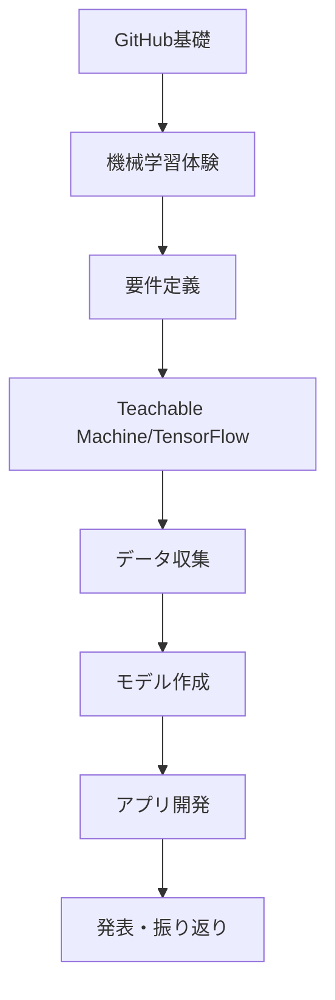

# 工業高校生向け「要件定義から始める傷検出AIアプリ開発」

製造現場で実際に使える傷検出AIアプリを、要件定義から開発まで体験する授業プログラムです。

## 📚 授業概要

- **対象**: 工業高校2-3年生（プログラミング初心者）
- **時間**: 全12時間（50分×12コマ）
- **目標**: 要件定義から始めて、AIを活用しながら実用的な傷検出アプリを開発する
- **新規追加**: AI画像生成技術の習得

### 必要な環境・準備物
- インターネット接続可能なPC（1人1台）
- Googleアカウント
- GitHubアカウント
- スマートフォン（グループに1台以上）
- 撮影用の部品や工具類（良品・不良品サンプル）
- 撮影ボックスと照明

## 🗂️ プロジェクト構成

```
vision-sys/
├── README.md（本ファイル）
├── sample_codes/
│   ├── 01_teachable_machine_体験.ipynb     # Teachable Machine入門
│   ├── 02_傷検出AI開発.ipynb               # Teachable Machine実践版
│   └── 03_傷検出AI開発_シンプル版.ipynb    # TensorFlow直接実装版
├── codespaces/                     # GitHub Codespaces用実行スクリプト
│   ├── README.md                   # Codespaces使用ガイド
│   ├── 01_github_basics/           # GitHub基礎実習
│   ├── 02_ml_intro/               # 機械学習入門実習
│   ├── 03_teachable_machine/      # Teachable Machine実習
│   ├── 04_requirements/           # 要件定義実習
│   ├── 05_app_dev/               # アプリ開発実習
│   └── 06_image_generation/       # AI画像生成実習
├── kaggle_notebooks/              # Kaggle Notebook用スクリプト
│   ├── README.md                   # Kaggle使用ガイド
│   ├── 01_ml_intro_kaggle.py      # 機械学習入門
│   ├── 02_teachable_machine_kaggle.py  # Teachable Machine
│   ├── 03_damage_detection_kaggle.py   # 傷検出アプリ
│   └── 04_image_generation_kaggle.py   # AI画像生成
└── 授業テキスト/
    ├── 01_GitHub基礎.md          # GitHubの使い方
    ├── 02_機械学習入門.md        # AIの基礎概念
    ├── 03_Teachable_Machine使い方.md  # ノーコードAI開発
    ├── 04_要件定義.md            # 設計の重要性
    ├── 05_アプリ開発.md          # 実装とデプロイ
    └── 06_AI画像生成入門.md      # Stable Diffusion活用
```

## 🎯 学習パス

### 初心者向けパス（Teachable Machine使用）
```
GitHub基礎 → 機械学習入門 → Teachable Machine → 要件定義 → アプリ開発
```

### 発展的パス（TensorFlow直接実装）
```
GitHub基礎 → 機械学習入門 → シンプル版開発 → 要件定義 → 高度なカスタマイズ
```

---

## 📋 授業計画

### 第1部：基礎スキルの習得（3時間）

#### 第1時：GitHubの基礎を学ぶ（50分）
**学習目標**: GitHubでプロジェクト管理ができるようになる

**授業内容**:
1. GitHub学習サイトでの自習（30分）
   - https://itoksk.github.io/GitHub-demo にアクセス
   - 「基礎編 Day 1」を実施
   - 自分のリポジトリを作成

2. プロジェクト用リポジトリ準備（20分）
   - 「damage-detection-app」リポジトリ作成
   - フォルダ構造の作成

#### 第2時：ディープラーニングで物体認識を体験（50分）
**学習目標**: AIの仕組みを理解する

**授業内容**:
1. Google Colabでの物体認識体験（30分）
   - VGG16モデルで画像認識
   - 特徴マップの可視化を体験
   - YOLOとOpenCVによる人物検出も体験

2. Teachable Machineでモデル作成（20分）
   - 簡単な分類モデルを作成
   - モデルのエクスポート方法を学ぶ

#### 第3時：要件定義の重要性を学ぶ（50分）
**学習目標**: ソフトウェア開発における要件定義の重要性を理解する

**授業内容**:
1. 要件定義とは？（15分）
2. 要件定義書の書き方（20分）
   - 5W1Hで整理する
3. グループワーク：要件を考える（15分）

### 第2部：要件定義とAI活用開発（4時間）

#### 第4時：詳細な要件定義書作成（50分）
**学習目標**: 実際の開発に使える要件定義書を作成する

#### 第5時：AIを使った開発計画（50分）
**学習目標**: ChatGPTやClaude等のAIを開発パートナーとして活用する方法を学ぶ

#### 第6-7時：データ収集とモデル作成（100分）
**学習目標**: 高品質なデータセットを作成し、AIモデルを構築

### 第3部：アプリ実装とデプロイ（3時間）

#### 第8-9時：Google Colabでアプリ開発（100分）
**学習目標**: AIのサポートを受けながら、実用的なWebアプリを完成させる

#### 第10時：AI画像生成入門（50分）
**学習目標**: Stable Diffusionを使ってAI画像生成の基礎を学ぶ

#### 第11-12時：画像生成活用と発表（100分）
**学習目標**: 製造業でのAI画像生成活用を考え、プロジェクトの成果を発表する

---

## 🎯 学習の流れ



---

## 📝 要件定義書テンプレート

```markdown
# 傷検出AIアプリ要件定義書

## 1. プロジェクト概要
- プロジェクト名：
- 目的：
- 期待される効果：

## 2. 機能要件
### 必須機能
- [ ] 画像アップロード機能
- [ ] 傷の有無判定
- [ ] 判定結果の表示

### あったら良い機能
- [ ] 傷の位置表示
- [ ] 判定履歴の保存
- [ ] 複数画像の一括処理

## 3. 非機能要件
- 判定速度：3秒以内
- 判定精度：90%以上
- 使いやすさ：説明書なしで使える

## 4. 制約条件
- 開発期間：6時間（授業3回分）
- 使用技術：Python、Teachable Machine/TensorFlow、Google Colab
- 対象部品：金属部品（10cm以下）

## 5. データ要件
- 良品画像：100枚以上
- 不良品画像：100枚以上
- テスト画像：各20枚
```

---

## 💡 AIを活用した開発のコツ

### 良い質問の例
```
私は工業高校生で、金属部品の傷を検出するAIアプリを作りたいです。
以下の要件があります：
- Teachable Machineで作ったモデルを使う
- Google Colabで動かす
- Gradioで簡単なUIを作る

まず何から始めれば良いですか？
```

### プロンプトエンジニアリングの基礎
1. **背景を説明する**: 自分の状況と目的を明確に
2. **具体的な条件を示す**: 使用ツールや制約を明記
3. **段階的に質問する**: 一度に全てを聞かない

---

## 💻 GitHub Codespacesでの実行

### Codespacesの起動
1. GitHubでこのリポジトリを開く
2. 緑色の「Code」ボタンをクリック
3. 「Codespaces」タブを選択
4. 「Create codespace on main」をクリック

### セットアップ
```bash
# Codespacesが起動したら実行
bash setup_codespaces.sh
```

### 各授業の実行方法
```bash
# 機械学習入門
cd codespaces/02_ml_intro
python codespaces_ml_intro.py sample.jpg

# Gradioアプリ
cd codespaces/05_app_dev
python gradio_app.py

# AI画像生成
cd codespaces/06_image_generation
python generate_image.py --prompt "industrial robot"
```

詳細は [codespaces/README.md](codespaces/README.md) を参照してください。

### Kaggle Notebookでの実行
```bash
# Kaggle.comでNotebookを作成
# 各スクリプトをコピー&ペーストして実行
# 詳細は kaggle_notebooks/README.md を参照
```

---

## 🔧 サンプルコードの使い方

### 1. Teachable Machine体験用（初心者向け）
`sample_codes/01_teachable_machine_体験.ipynb`

**特徴**:
- Teachable Machineで作成したモデルを簡単に試せる
- 画像のアップロード・撮影機能付き
- 結果を分かりやすくグラフで表示
- プログラミング知識がほとんど不要

**適している場合**:
- プログラミング初心者
- 短時間で成果を出したい
- AIの概念を体験的に学びたい

### 2. 傷検出AI開発用（実践向け）
`sample_codes/02_傷検出AI開発.ipynb`

**特徴**:
- Teachable Machineモデルを活用した本格的なアプリ
- データ収集から管理まで一貫したシステム
- Gradioによる実用的なWebアプリ
- バッチ処理や履歴管理機能
- 性能評価レポート生成

**適している場合**:
- 実用的なアプリを作りたい
- チーム開発を体験したい
- 製造現場での活用を想定

### 3. 傷検出AI開発シンプル版（発展的）
`sample_codes/03_傷検出AI開発_シンプル版.ipynb`

**特徴**:
- TensorFlow/Kerasを直接使用
- CNNの仕組みを理解できる
- モデル構造を自由にカスタマイズ可能
- 軽量で高速な実装
- 学習過程を可視化

**適している場合**:
- AIの仕組みを深く理解したい
- カスタマイズ性を重視
- プログラミングに興味がある
- 将来エンジニアを目指す

### 実装方法の比較

| 項目 | Teachable Machine版 | TensorFlow直接実装版 |
|------|-------------------|-------------------|
| **難易度** | 簡単 | 中程度 |
| **学習時間** | 1-2時間 | 3-4時間 |
| **カスタマイズ性** | 低い | 高い |
| **モデルサイズ** | 大きい（10MB+） | 小さい（1-5MB） |
| **処理速度** | 普通 | 速い |
| **教育的価値** | 基礎理解 | 深い理解 |

---

## 📊 評価基準

1. **要件定義書の完成度**（25%）
   - 具体性と実現可能性

2. **AIの活用度**（25%）
   - 適切な質問と回答の活用

3. **アプリの完成度**（25%）
   - 要件を満たしているか

4. **チームワーク**（25%）
   - GitHubでの協働作業

---

## 🚀 発展学習

### さらに学びたい人へ
- Raspberry Piを使った組み込みAI
- エッジコンピューティング
- リアルタイム画像処理
- 複数カメラでの3D認識
- 転移学習によるモデル改善
- データ拡張技術
- AI画像生成でのカスタムモデル作成
- LoRAやDreamBoothでの専門的な学習

### 実用化に向けて
- スマートフォンアプリ化
- リアルタイム検出（カメラ連携）
- 複数の欠陥種類の分類
- 検査履歴の記録システム
- クラウド連携
- IoTセンサーとの統合

---

## 📚 参考資料

### オンラインリソース
- [GitHub学習サイト](https://itoksk.github.io/GitHub-demo)
- [Teachable Machine](https://teachablemachine.withgoogle.com/)
- [Google Colab](https://colab.research.google.com/)
- [TensorFlow チュートリアル](https://www.tensorflow.org/tutorials)
- [Gradio ドキュメント](https://gradio.app/docs/)

### 技術情報
- TensorFlow/Keras ドキュメント
- 画像認識の基礎理論
- CNNアーキテクチャ
- Python 基礎文法

---

## 🤝 サポート

### 困ったときは
1. まずAIに質問してみる（ChatGPT、Claude等）
2. エラーメッセージをそのままコピーして検索
3. GitHubのIssuesで質問
4. 先生やクラスメートに相談

### よくある質問

**Q: Teachable Machineからモデルをダウンロードする時は何を選べばいい？**
A: 
1. 「モデルをエクスポート」をクリック
2. 「Tensorflow」タブを選択
3. 「Keras」を選択
4. 「モデルをダウンロード」をクリック
→ `keras_model.h5`と`labels.txt`の2つのファイルがダウンロードされます

**Q: Teachable Machineとシンプル版、どちらを選べばいい？**
A: 
- 初心者・時間が限られている → Teachable Machine版
- プログラミングに興味がある・カスタマイズしたい → シンプル版

**Q: モデルが読み込めない**
A: ファイル名が正しいか確認。Teachable Machine版は`keras_model.h5`と`labels.txt`が必要

**Q: 画像認識の精度が低い**
A: 
- データの質と量を確認（各クラス50枚以上推奨）
- 照明条件を統一する
- 背景をシンプルにする
- データ拡張を活用する

**Q: Gradioが起動しない**
A: ライブラリのインストールを確認。`!pip install gradio --upgrade`を実行

**Q: 学習が進まない・時間がかかる**
A: 
- バッチサイズを小さくする
- エポック数を減らす
- 画像サイズを小さくする（128×128など）

---

## 🏆 プロジェクト例

### 過去の優秀作品
1. **ネジ山損傷検出システム**
   - 精度：95%
   - 特徴：360度回転撮影対応

2. **溶接部欠陥検出AI**
   - 精度：92%
   - 特徴：複数の欠陥タイプを分類

3. **塗装ムラ検出アプリ**
   - 精度：88%
   - 特徴：色差分析を組み合わせた判定

---

## 📄 ライセンス

このプロジェクトは教育目的で作成されています。
自由に改変・再配布可能です。

---

## 🙏 謝辞

本プログラムは、製造現場のニーズと教育現場の要望を基に作成されました。
ご協力いただいた全ての方々に感謝いたします。

---

## 📧 お問い合わせ

質問や改善提案は、GitHubのIssuesまたはPull Requestでお願いします。