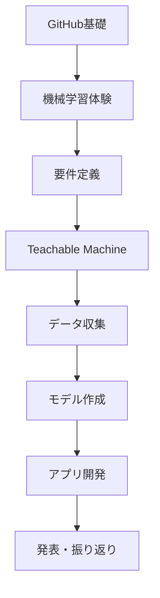

# 工業高校生向け「要件定義から始める傷検出AIアプリ開発」

製造現場で実際に使える傷検出AIアプリを、要件定義から開発まで体験する授業プログラムです。

## 📚 授業概要

- **対象**: 工業高校2-3年生（プログラミング初心者）
- **時間**: 全10時間（50分×10コマ）
- **目標**: 要件定義から始めて、AIを活用しながら実用的な傷検出アプリを開発する

### 必要な環境・準備物
- インターネット接続可能なPC（1人1台）
- Googleアカウント
- GitHubアカウント
- スマートフォン（グループに1台以上）
- 撮影用の部品や工具類（良品・不良品サンプル）
- 撮影ボックスと照明

## 🗂️ プロジェクト構成

```
vision-sys/
├── README.md（本ファイル）
├── sample_codes/
│   ├── 01_teachable_machine_体験.ipynb
│   └── 02_傷検出AI開発.ipynb
└── 授業テキスト/
    ├── 01_GitHub基礎.md
    ├── 02_機械学習入門.md
    ├── 03_Teachable_Machine使い方.md
    ├── 04_要件定義.md
    └── 05_アプリ開発.md
```

---

## 📋 授業計画

### 第1部：基礎スキルの習得（3時間）

#### 第1時：GitHubの基礎を学ぶ（50分）
**学習目標**: GitHubでプロジェクト管理ができるようになる

**授業内容**:
1. GitHub学習サイトでの自習（30分）
   - https://itoksk.github.io/GitHub-demo にアクセス
   - 「基礎編 Day 1」を実施
   - 自分のリポジトリを作成

2. プロジェクト用リポジトリ準備（20分）
   - 「damage-detection-app」リポジトリ作成
   - フォルダ構造の作成

#### 第2時：ディープラーニングで物体認識を体験（50分）
**学習目標**: AIの仕組みを理解する

**授業内容**:
1. Google Colabでの物体認識体験（30分）
   - VGG16モデルで画像認識
   - 特徴マップの可視化を体験

2. Teachable Machineでモデル作成（20分）
   - 簡単な分類モデルを作成
   - モデルのエクスポート方法を学ぶ

#### 第3時：要件定義の重要性を学ぶ（50分）
**学習目標**: ソフトウェア開発における要件定義の重要性を理解する

**授業内容**:
1. 要件定義とは？（15分）
2. 要件定義書の書き方（20分）
   - 5W1Hで整理する
3. グループワーク：要件を考える（15分）

### 第2部：要件定義とAI活用開発（4時間）

#### 第4時：詳細な要件定義書作成（50分）
**学習目標**: 実際の開発に使える要件定義書を作成する

#### 第5時：AIを使った開発計画（50分）
**学習目標**: ChatGPTやClaude等のAIを開発パートナーとして活用する方法を学ぶ

#### 第6-7時：データ収集とモデル作成（100分）
**学習目標**: 高品質なデータセットを作成し、Teachable Machineでモデルを構築

### 第3部：アプリ実装とデプロイ（3時間）

#### 第8-9時：Google Colabでアプリ開発（100分）
**学習目標**: AIのサポートを受けながら、実用的なWebアプリを完成させる

#### 第10時：発表と振り返り（50分）
**学習目標**: プロジェクトの成果を共有し、開発プロセスを振り返る

---

## 🎯 学習の流れ



---

## 📝 要件定義書テンプレート

```markdown
# 傷検出AIアプリ要件定義書

## 1. プロジェクト概要
- プロジェクト名：
- 目的：
- 期待される効果：

## 2. 機能要件
### 必須機能
- [ ] 画像アップロード機能
- [ ] 傷の有無判定
- [ ] 判定結果の表示

### あったら良い機能
- [ ] 傷の位置表示
- [ ] 判定履歴の保存
- [ ] 複数画像の一括処理

## 3. 非機能要件
- 判定速度：3秒以内
- 判定精度：90%以上
- 使いやすさ：説明書なしで使える

## 4. 制約条件
- 開発期間：6時間
- 使用技術：Python、Teachable Machine、Google Colab
- 対象部品：金属部品（10cm以下）

## 5. データ要件
- 良品画像：100枚以上
- 不良品画像：100枚以上
- テスト画像：各20枚
```

---

## 💡 AIを活用した開発のコツ

### 良い質問の例
```
私は工業高校生で、金属部品の傷を検出するAIアプリを作りたいです。
以下の要件があります：
- Teachable Machineで作ったモデルを使う
- Google Colabで動かす
- Gradioで簡単なUIを作る

まず何から始めれば良いですか？
```

### プロンプトエンジニアリングの基礎
1. **背景を説明する**: 自分の状況と目的を明確に
2. **具体的な条件を示す**: 使用ツールや制約を明記
3. **段階的に質問する**: 一度に全てを聞かない

---

## 🔧 サンプルコードの使い方

### 1. Teachable Machine体験用（初心者向け）
`sample_codes/01_teachable_machine_体験.ipynb`

- Teachable Machineで作成したモデルを簡単に試せる
- 画像のアップロード・撮影機能付き
- 結果を分かりやすくグラフで表示

### 2. 傷検出AI開発用（実践向け）
`sample_codes/02_傷検出AI開発.ipynb`

- データ収集から管理まで一貫したシステム
- Gradioによる本格的なWebアプリ
- バッチ処理や履歴管理機能
- 性能評価レポート生成

---

## 📊 評価基準

1. **要件定義書の完成度**（25%）
   - 具体性と実現可能性

2. **AIの活用度**（25%）
   - 適切な質問と回答の活用

3. **アプリの完成度**（25%）
   - 要件を満たしているか

4. **チームワーク**（25%）
   - GitHubでの協働作業

---

## 🚀 発展学習

### さらに学びたい人へ
- Raspberry Piを使った組み込みAI
- エッジコンピューティング
- リアルタイム画像処理
- 複数カメラでの3D認識

### 実用化に向けて
- スマートフォンアプリ化
- リアルタイム検出（カメラ連携）
- 複数の欠陥種類の分類
- 検査履歴の記録システム

---

## 📚 参考資料

### オンラインリソース
- [GitHub学習サイト](https://itoksk.github.io/GitHub-demo)
- [Teachable Machine](https://teachablemachine.withgoogle.com/)
- [Google Colab](https://colab.research.google.com/)

### 技術情報
- TensorFlow/Keras ドキュメント
- Gradio ドキュメント
- Python 基礎文法

---

## 🤝 サポート

### 困ったときは
1. まずAIに質問してみる（ChatGPT、Claude等）
2. エラーメッセージをそのままコピーして検索
3. GitHubのIssuesで質問
4. 先生やクラスメートに相談

### よくある質問
- **Q: Teachable Machineのモデルが読み込めない**
  - A: ファイル名が正しいか確認。`keras_model.h5`と`labels.txt`が必要

- **Q: 画像認識の精度が低い**
  - A: データの質と量を確認。照明条件を統一する

- **Q: Gradioが起動しない**
  - A: ライブラリのインストールを確認。`!pip install gradio`を実行

---

## 📄 ライセンス

このプロジェクトは教育目的で作成されています。
自由に改変・再配布可能です。

---

## 🙏 謝辞

本プログラムは、製造現場のニーズと教育現場の要望を基に作成されました。
ご協力いただいた全ての方々に感謝いたします。