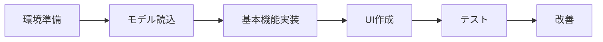

# 第8-9時：傷検出AIアプリを開発しよう

## 🎯 今日の目標
要件定義書を基に、実際に動く傷検出AIアプリを完成させる！

---

## 📝 開発の準備

### 必要なもの確認

- [ ] Google Colabにアクセスできる
- [ ] Teachable Machineで作ったモデル（keras_model.h5、labels.txt）
- [ ] 要件定義書
- [ ] テスト用の画像

### 開発の流れ



---

## 🚀 ステップ1：Google Colabの準備

### 新しいノートブックを作成

1. **Google Colabを開く**
   - https://colab.research.google.com/
   - 「ファイル」→「新しいノートブック」

2. **名前を変更**
   - `傷検出AIアプリ_チーム名.ipynb`

3. **GitHubに保存設定**
   - 「ファイル」→「GitHub にコピーを保存」
   - リポジトリを選択

### 必要なライブラリをインストール

```python
# セル1：ライブラリのインストール
print("📦 必要なライブラリをインストールしています...")

!pip install tensorflow gradio opencv-python pillow numpy pandas matplotlib
!pip install -q gradio --upgrade

print("✅ インストール完了！")
```

実行方法：`Shift + Enter`

---

## 📂 ステップ2：プロジェクトの構造を作る

### Google Driveと連携

```python
# セル2：Google Driveのマウント
from google.colab import drive
drive.mount('/content/drive')

# プロジェクトフォルダの作成
import os
project_name = "damage_detection_project"  # あなたのプロジェクト名に変更
project_path = f'/content/drive/MyDrive/{project_name}'

# フォルダ構造を作成
folders = ['models', 'test_images', 'results', 'logs']
for folder in folders:
    os.makedirs(f'{project_path}/{folder}', exist_ok=True)
    
print(f"✅ プロジェクトフォルダを作成しました: {project_path}")
print("📁 フォルダ構造:")
for folder in folders:
    print(f"  └── {folder}/")
```

### モデルファイルをアップロード

```python
# セル3：モデルファイルのアップロード
from google.colab import files

print("📤 Teachable Machineで作成したファイルをアップロードしてください")
print("必要なファイル:")
print("  1. keras_model.h5")
print("  2. labels.txt")

uploaded = files.upload()

# アップロードしたファイルをmodelsフォルダに移動
import shutil
for filename in uploaded.keys():
    shutil.move(filename, f"{project_path}/models/{filename}")
    print(f"✅ {filename} を保存しました")
```

---

## 🤖 ステップ3：AIモデルの実装

### 基本的な検出器クラス

```python
# セル4：検出器クラスの定義
import tensorflow as tf
import numpy as np
from PIL import Image
from datetime import datetime
import json

class DamageDetector:
    """傷検出AIクラス"""
    
    def __init__(self, model_path, labels_path):
        """初期化"""
        print("🤖 AIモデルを読み込んでいます...")
        
        # モデルとラベルの読み込み
        self.model = tf.keras.models.load_model(model_path, compile=False)
        
        # ラベルの読み込み
        with open(labels_path, 'r', encoding='utf-8') as f:
            self.labels = [line.strip() for line in f.readlines()]
        
        # 検査履歴を保存するリスト
        self.history = []
        
        print("✅ モデルの準備完了！")
        print(f"認識可能なクラス: {self.labels}")
    
    def predict(self, image):
        """画像から傷を検出"""
        # 画像の前処理
        if isinstance(image, str):
            # ファイルパスの場合
            img = Image.open(image).convert('RGB')
        else:
            # numpy配列の場合
            img = Image.fromarray(image).convert('RGB')
        
        # サイズを224x224に変更（Teachable Machineの要求サイズ）
        img = img.resize((224, 224))
        
        # numpy配列に変換して正規化
        img_array = np.array(img) / 255.0
        img_array = np.expand_dims(img_array, axis=0)
        
        # 予測実行
        predictions = self.model.predict(img_array, verbose=0)
        
        # 結果を辞書形式で返す
        results = {}
        for i, label in enumerate(self.labels):
            # "0 良品" → "良品" のように番号を除去
            clean_label = label.split(' ', 1)[1] if ' ' in label else label
            results[clean_label] = float(predictions[0][i])
        
        # 履歴に追加
        self.history.append({
            'timestamp': datetime.now().strftime('%Y-%m-%d %H:%M:%S'),
            'results': results
        })
        
        return results

# 検出器のインスタンスを作成
detector = DamageDetector(
    model_path=f"{project_path}/models/keras_model.h5",
    labels_path=f"{project_path}/models/labels.txt"
)
```

### テスト実行

```python
# セル5：動作テスト
# テスト画像をアップロード
print("🖼️ テスト用の画像をアップロードしてください")
test_upload = files.upload()

# 最初の画像でテスト
test_image = list(test_upload.keys())[0]
results = detector.predict(test_image)

print("\n📊 検出結果:")
for label, probability in results.items():
    print(f"  {label}: {probability:.1%}")
    
# 最も確率の高いクラスを表示
max_label = max(results, key=results.get)
print(f"\n🎯 判定: {max_label}")
```

---

## 🎨 ステップ4：Gradioで使いやすいUIを作る

### シンプルなUI版

```python
# セル6：シンプルなGradio UI
import gradio as gr

def simple_detect(image):
    """シンプルな検出関数"""
    if image is None:
        return "画像をアップロードしてください"
    
    # 検出実行
    results = detector.predict(image)
    
    # 結果のメッセージを作成
    max_label = max(results, key=results.get)
    confidence = results[max_label]
    
    if max_label == "不良品" or max_label == "bad":
        emoji = "❌"
        message = "不良品が検出されました"
    else:
        emoji = "✅"
        message = "良品です"
    
    output = f"{emoji} 判定: {max_label}\n"
    output += f"確信度: {confidence:.1%}\n\n"
    output += "詳細:\n"
    for label, prob in results.items():
        output += f"  {label}: {prob:.1%}\n"
    
    return output

# Gradioインターフェースの作成
simple_app = gr.Interface(
    fn=simple_detect,
    inputs=gr.Image(label="検査画像", type="numpy"),
    outputs=gr.Textbox(label="判定結果", lines=5),
    title="🔍 傷検出AIシステム（シンプル版）",
    description="部品の画像をアップロードすると、AIが傷の有無を判定します。"
)

# アプリを起動
simple_app.launch(share=True)
```

### 高機能版UI

```python
# セル7：高機能なGradio UI
import pandas as pd

# グローバル変数として履歴を保存
inspection_history = []

def advanced_detect(image):
    """高度な検出関数"""
    if image is None:
        return None, "画像をアップロードしてください", None, None
    
    # 検出実行
    results = detector.predict(image)
    
    # 判定ロジック
    bad_prob = results.get('不良品', results.get('bad', 0))
    good_prob = results.get('良品', results.get('good', 0))
    
    # 判定基準（要件定義書に基づく）
    if bad_prob > 0.8:
        status = "不良品"
        action = "廃棄または再加工を推奨"
        emoji = "❌"
        confidence = "高"
    elif bad_prob > 0.5:
        status = "要確認"
        action = "目視での再確認を推奨"
        emoji = "⚠️"
        confidence = "中"
    else:
        status = "良品"
        action = "次工程へ進めて問題ありません"
        emoji = "✅"
        confidence = "高"
    
    # メッセージ作成
    message = f"""
### {emoji} 判定結果: {status}

**信頼度**: {confidence}
**推奨アクション**: {action}

**詳細確率**:
- 良品: {good_prob:.1%}
- 不良品: {bad_prob:.1%}
"""
    
    # 履歴に追加
    inspection_history.append({
        '検査日時': datetime.now().strftime('%Y-%m-%d %H:%M:%S'),
        '判定': status,
        '信頼度': confidence,
        '不良品確率': f"{bad_prob:.1%}"
    })
    
    # 履歴データフレーム（最新10件）
    history_df = pd.DataFrame(inspection_history[-10:])
    
    # 統計情報
    if len(inspection_history) > 0:
        total = len(inspection_history)
        good_count = sum(1 for h in inspection_history if h['判定'] == '良品')
        bad_count = sum(1 for h in inspection_history if h['判定'] == '不良品')
        check_count = sum(1 for h in inspection_history if h['判定'] == '要確認')
        
        stats = f"""
### 📊 検査統計（本日）
- **総検査数**: {total}件
- **良品**: {good_count}件 ({good_count/total*100:.1f}%)
- **不良品**: {bad_count}件 ({bad_count/total*100:.1f}%)
- **要確認**: {check_count}件 ({check_count/total*100:.1f}%)
"""
    else:
        stats = "統計情報はまだありません"
    
    return results, message, history_df, stats

# 高機能UIの作成
with gr.Blocks(title="傷検出AIシステム", theme=gr.themes.Soft()) as advanced_app:
    gr.Markdown("""
    # 🏭 傷検出AIシステム
    
    製造部品の傷を自動で検出します。画像をアップロードして「検査開始」をクリックしてください。
    """)
    
    with gr.Tab("🔍 検査"):
        with gr.Row():
            with gr.Column(scale=1):
                input_image = gr.Image(
                    label="検査画像",
                    type="numpy",
                    height=300
                )
                inspect_btn = gr.Button(
                    "🔍 検査開始",
                    variant="primary",
                    size="lg"
                )
                
                # 使い方
                with gr.Accordion("📖 使い方", open=False):
                    gr.Markdown("""
                    1. 検査したい部品の画像をアップロード
                    2. 「検査開始」ボタンをクリック
                    3. AIが傷の有無を判定します
                    
                    **撮影のコツ**:
                    - 明るい場所で撮影
                    - 部品全体が写るように
                    - ピントを合わせる
                    """)
            
            with gr.Column(scale=1):
                output_label = gr.Label(
                    label="判定確率",
                    num_top_classes=2
                )
                output_message = gr.Markdown(
                    label="判定結果",
                    value="画像をアップロードしてください"
                )
    
    with gr.Tab("📊 統計"):
        stats_display = gr.Markdown(label="統計情報")
        history_table = gr.Dataframe(
            label="検査履歴（最新10件）",
            headers=["検査日時", "判定", "信頼度", "不良品確率"]
        )
        
        export_btn = gr.Button("📥 履歴をダウンロード", variant="secondary")
        export_msg = gr.Textbox(label="ダウンロード状態", interactive=False)
    
    # イベントハンドラー
    inspect_btn.click(
        fn=advanced_detect,
        inputs=input_image,
        outputs=[output_label, output_message, history_table, stats_display]
    )
    
    def export_history():
        if len(inspection_history) > 0:
            df = pd.DataFrame(inspection_history)
            filename = f"inspection_history_{datetime.now().strftime('%Y%m%d_%H%M%S')}.csv"
            df.to_csv(filename, index=False, encoding='utf-8-sig')
            return f"✅ {filename} として保存しました"
        return "❌ エクスポートする履歴がありません"
    
    export_btn.click(fn=export_history, outputs=export_msg)

# アプリを起動
advanced_app.launch(share=True)
```

---

## 🧪 ステップ5：テストと改善

### テストシート作成

```python
# セル8：テスト実行と記録
def run_tests(test_folder):
    """テストを実行して結果を記録"""
    test_results = []
    
    # テストフォルダ内の画像を取得
    test_images = []
    for category in ['good', 'bad']:
        folder = f"{test_folder}/{category}"
        if os.path.exists(folder):
            for img in os.listdir(folder):
                if img.endswith(('.jpg', '.png', '.jpeg')):
                    test_images.append({
                        'path': f"{folder}/{img}",
                        'true_label': '良品' if category == 'good' else '不良品',
                        'filename': img
                    })
    
    # 各画像でテスト
    for img_info in test_images:
        results = detector.predict(img_info['path'])
        
        # 予測ラベルを決定
        bad_prob = results.get('不良品', results.get('bad', 0))
        if bad_prob > 0.5:
            pred_label = '不良品'
        else:
            pred_label = '良品'
        
        # 正解かどうか
        correct = img_info['true_label'] == pred_label
        
        test_results.append({
            'ファイル名': img_info['filename'],
            '正解': img_info['true_label'],
            '予測': pred_label,
            '不良品確率': f"{bad_prob:.1%}",
            '判定': '○' if correct else '×'
        })
    
    # データフレームに変換
    results_df = pd.DataFrame(test_results)
    
    # 精度計算
    accuracy = sum(1 for r in test_results if r['判定'] == '○') / len(test_results)
    
    print(f"📊 テスト結果")
    print(f"テスト画像数: {len(test_results)}枚")
    print(f"精度: {accuracy:.1%}")
    print("\n詳細:")
    print(results_df)
    
    # CSVに保存
    results_df.to_csv(f"{project_path}/results/test_results.csv", index=False, encoding='utf-8-sig')
    
    return results_df, accuracy

# テスト画像フォルダを指定して実行
# test_results, accuracy = run_tests(f"{project_path}/test_images")
```

### パフォーマンス測定

```python
# セル9：処理速度の測定
import time

def measure_performance(image_path, n_trials=10):
    """処理速度を測定"""
    times = []
    
    for i in range(n_trials):
        start_time = time.time()
        _ = detector.predict(image_path)
        end_time = time.time()
        
        process_time = end_time - start_time
        times.append(process_time)
    
    avg_time = np.mean(times)
    max_time = np.max(times)
    min_time = np.min(times)
    
    print(f"⏱️ パフォーマンス測定結果（{n_trials}回の平均）")
    print(f"平均処理時間: {avg_time:.3f}秒")
    print(f"最速: {min_time:.3f}秒")
    print(f"最遅: {max_time:.3f}秒")
    
    # 要件（3秒以内）を満たしているか
    if avg_time <= 3.0:
        print("✅ 要件を満たしています（3秒以内）")
    else:
        print("❌ 要件を満たしていません（3秒を超過）")
    
    return times

# 測定実行
# times = measure_performance("test_image.jpg")
```

---

## 🎯 ステップ6：カスタマイズと拡張

### カメラ連携機能の追加

```python
# セル10：カメラ撮影機能（オプション）
from IPython.display import display, Javascript
from google.colab.output import eval_js
from base64 import b64decode
import io

def take_photo(filename='photo.jpg', quality=0.8):
    """Webカメラで写真を撮影"""
    js = Javascript('''
    async function takePhoto(quality) {
      const div = document.createElement('div');
      const capture = document.createElement('button');
      capture.textContent = '📸 撮影';
      capture.style.padding = '10px 20px';
      capture.style.fontSize = '16px';
      capture.style.backgroundColor = '#4CAF50';
      capture.style.color = 'white';
      capture.style.border = 'none';
      capture.style.borderRadius = '5px';
      capture.style.cursor = 'pointer';
      
      div.appendChild(capture);

      const video = document.createElement('video');
      video.style.display = 'block';
      video.style.width = '400px';
      video.style.margin = '10px 0';
      
      const stream = await navigator.mediaDevices.getUserMedia({video: true});

      document.body.appendChild(div);
      div.appendChild(video);
      video.srcObject = stream;
      await video.play();

      google.colab.output.setIframeHeight(document.documentElement.scrollHeight, true);

      await new Promise((resolve) => capture.onclick = resolve);

      const canvas = document.createElement('canvas');
      canvas.width = video.videoWidth;
      canvas.height = video.videoHeight;
      canvas.getContext('2d').drawImage(video, 0, 0);
      stream.getVideoTracks()[0].stop();
      div.remove();
      return canvas.toDataURL('image/jpeg', quality);
    }
    ''')
    display(js)
    data = eval_js('takePhoto({})'.format(quality))
    binary = b64decode(data.split(',')[1])
    
    with open(filename, 'wb') as f:
        f.write(binary)
    
    return filename

# カメラ撮影テスト
# photo = take_photo()
# results = detector.predict(photo)
# print(f"撮影した画像の判定結果: {results}")
```

### バッチ処理機能

```python
# セル11：複数画像の一括処理
def batch_process(image_folder):
    """フォルダ内の画像を一括処理"""
    results = []
    
    # フォルダ内の画像を取得
    images = [f for f in os.listdir(image_folder) 
              if f.endswith(('.jpg', '.png', '.jpeg'))]
    
    print(f"🔄 {len(images)}枚の画像を処理します...")
    
    for i, img_file in enumerate(images):
        img_path = os.path.join(image_folder, img_file)
        
        # 検出実行
        detection_result = detector.predict(img_path)
        
        # 判定
        bad_prob = detection_result.get('不良品', detection_result.get('bad', 0))
        if bad_prob > 0.5:
            judgment = '不良品'
        else:
            judgment = '良品'
        
        results.append({
            'ファイル名': img_file,
            '判定': judgment,
            '不良品確率': bad_prob,
            '処理日時': datetime.now().strftime('%Y-%m-%d %H:%M:%S')
        })
        
        # 進捗表示
        print(f"  [{i+1}/{len(images)}] {img_file} → {judgment}")
    
    # 結果をDataFrameに
    results_df = pd.DataFrame(results)
    
    # 統計表示
    print("\n📊 バッチ処理結果:")
    print(f"総数: {len(results)}枚")
    print(f"良品: {sum(1 for r in results if r['判定'] == '良品')}枚")
    print(f"不良品: {sum(1 for r in results if r['判定'] == '不良品')}枚")
    
    return results_df

# バッチ処理実行例
# batch_results = batch_process(f"{project_path}/test_images")
```

---

## 📱 ステップ7：スマートフォン対応

### QRコードでアクセス

```python
# セル12：QRコード生成
import qrcode
from IPython.display import Image as IPImage

def generate_qr_code(url):
    """URLのQRコードを生成"""
    qr = qrcode.QRCode(
        version=1,
        error_correction=qrcode.constants.ERROR_CORRECT_L,
        box_size=10,
        border=4,
    )
    qr.add_data(url)
    qr.make(fit=True)
    
    img = qr.make_image(fill_color="black", back_color="white")
    img.save("app_qr.png")
    
    print("📱 スマートフォンでアクセス:")
    print("以下のQRコードを読み取ってください")
    display(IPImage("app_qr.png", width=200))

# Gradioアプリ起動時のpublic URLを使用
# generate_qr_code("https://xxxxx.gradio.live")
```

---

## 🎉 完成とまとめ

### 成果物チェックリスト

- [ ] **基本機能の実装**
  - [ ] 画像アップロード機能
  - [ ] AI判定機能
  - [ ] 結果表示機能

- [ ] **追加機能の実装**
  - [ ] 判定履歴の記録
  - [ ] 統計情報の表示
  - [ ] CSVエクスポート
  - [ ] バッチ処理（オプション）

- [ ] **品質要件の達成**
  - [ ] 処理時間3秒以内
  - [ ] 判定精度90%以上
  - [ ] エラーハンドリング

- [ ] **ドキュメント作成**
  - [ ] 使い方の説明
  - [ ] テスト結果の記録
  - [ ] 改善点のメモ

### プロジェクトの保存

```python
# セル13：プロジェクトの保存
# 全ての成果物をGitHubにプッシュ
print("💾 プロジェクトを保存しています...")

# 1. このノートブックを保存
print("1. ファイル → GitHub にコピーを保存")

# 2. モデルファイルの確認
print("2. models/フォルダにモデルファイルがあることを確認")

# 3. テスト結果の確認
print("3. results/フォルダにテスト結果があることを確認")

# 4. アプリのURLを記録
app_info = {
    "app_name": "傷検出AIシステム",
    "team": "あなたのチーム名",
    "created_date": datetime.now().strftime('%Y-%m-%d'),
    "model_accuracy": "記録した精度",
    "gradio_url": "アプリのURL"
}

with open(f"{project_path}/app_info.json", 'w', encoding='utf-8') as f:
    json.dump(app_info, f, ensure_ascii=False, indent=2)

print("✅ 保存完了！")
```

---

## 🤔 トラブルシューティング

### よくあるエラーと対処法

**エラー1: モデルが読み込めない**
```python
# ファイルパスを確認
print(os.listdir(f"{project_path}/models/"))
# keras_model.h5 と labels.txt があるか確認
```

**エラー2: Gradioが起動しない**
```python
# Gradioを再インストール
!pip install gradio --upgrade
# ランタイムを再起動
```

**エラー3: 画像が認識されない**
```python
# 画像形式を確認（JPG, PNG）
# 画像サイズを確認（大きすぎないか）
```

### パフォーマンスの改善

1. **画像サイズの最適化**
   - アップロード時に自動リサイズ

2. **キャッシュの活用**
   - 同じ画像は再計算しない

3. **バッチ処理の並列化**
   - 複数画像を同時処理

---

## 🏁 次回予告：発表準備

### 準備するもの
1. **デモ動画**（1-2分）
2. **プレゼン資料**（5枚程度）
3. **改善提案**（3つ以上）

### 発表で伝えること
- 作ったアプリの特徴
- 工夫した点
- 苦労した点
- 今後の改善案

**お疲れさまでした！素晴らしいアプリが完成しましたね！** 🎊